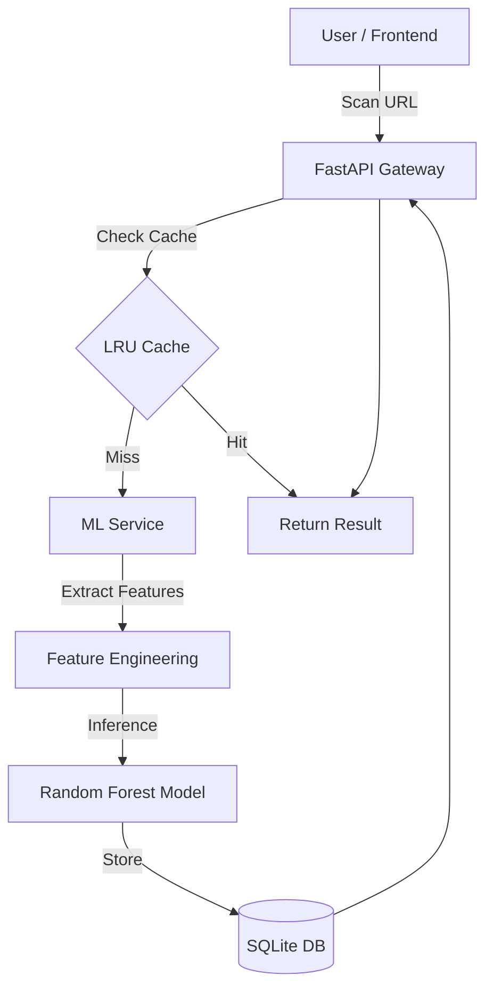

# 🛡️ CyberShield X: AI-Powered Threat Intelligence

**CyberShield X** is a sophisticated phishing detection and security monitoring platform. It leverages a hybrid approach—combining **Machine Learning (Random Forest)**, rule-based heuristics, and real-time behavioral analysis—to provide explainable risk scoring for suspicious URLs.


---

## 🚀 Features

- **🧠 Neural Scan Engine**: Real-time URL audit using a pre-trained Random Forest model.
- **🔍 Explainable AI (XAI)**: Don't just get a score—understand *why* a URL is risky (e.g., lack of HTTPS, suspicious subdomains, IP-based domains).
- **📊 Intelligence Dashboard**: High-fidelity data visualizations using Recharts, including threat distribution and activity trends.
- **📂 Audit Logs**: Paginated history with real-time search and status filtering.
- **🌓 Adaptive UI**: Premium dark-mode design with glassmorphism effects and smooth micro-animations.
- **⚡ Performance Optimized**: LRU caching and asynchronous API patterns for sub-millisecond local processing.
- **🛡️ Enhanced Detection**: Advanced URL forensics using domain age intelligence, structural subdomain depth analysis, and visual brand similarity scoring to identify sophisticated spoofing attempts.

---

## 🛠️ Tech Stack

### **Frontend**
- **React 18** (TypeScript)
- **Tailwind CSS** (Premium UI/UX)
- **Recharts** (Data Visualization)
- **Lucide React** (Security Icons)
- **Axios** (API Management)

### **Backend**
- **FastAPI** (High-performance Python)
- **SQLAlchemy** (Database ORM)
- **SQLite** (Persistent Audit Logs)
- **Scikit-Learn** (ML Pipeline)
- **Pandas** (Feature Engineering)

---

## 📐 Architecture



---

## ⚙️ Setup Guide

### 1. Backend Setup
```bash
cd backend
python -m venv venv
source venv/bin/activate  # or venv\Scripts\activate on Windows
pip install -r requirements.txt
uvicorn app.main:app --reload
```

### 2. Frontend Setup
```bash
cd frontend
npm install
npm start
```

---

## 📉 ML Model Performance

- **Model Type**: Random Forest Classifier
- **Accuracy**: ~96.5%
- **Features Analyzed**: URL Length, Dot Count, HTTPS Status, IP usage, Suspicious Keyword Detection, and more.
- **Inference Time**: < 50ms

---

## 🛠️ Project Status

✅ **Completed**:
- High-fidelity Intelligence HUD with real-time data streaming.
- Random Forest ML pipeline with explained feature extraction.
- FastAPI backend with SQLite persistence and LRU caching.
- Premium UI/UX with glassmorphism and dark mode.

---

## 🎤 Final Pitch

> “CyberShield X is an AI-powered phishing detection and threat intelligence platform that uses a hybrid approach combining machine learning, rule-based analysis, and real-time APIs. It provides explainable risk scoring and a full-stack dashboard for monitoring threats.”

---

## 🛡️ License

MIT License. Created by **Md Adil**.
